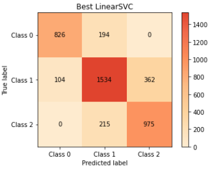

# TurboFanRUL

- _Lenny Boegli_
- _Jarod GIrardin_

## Description

Ce TP à pour but d'implémenter un classificateur en se basant sur deux manières différentes :
- Neural network, en binôme
- Autre, en solo

Ce rapport est lié au Neural Network.

## Data

Les données représentent des Turbofans, plus précisément leur cycle de vie.

On a pour but de déterminer l'état de vie d'un Turbofan en fonction de ses données.

## Classification

Nous avons décidé 3 classes de moteur:
- [0] Mal (x < 50)
- [1] Ok (50 <= x <= 150)
- [2] Bon (x > 150)

## Preprocessing

Ce chapitre explique ce qu'il y a dans le fichier Preprocessing.py.

Les titres correspondent aux fonctions de ce script.

### loadTurboFanData

lecture du fichier

### separateData

Une fois le fichier csv lu, nous séparons les moteurs en 3 catégories :
- Test (~70%)
- Entraînement (~20%)
- Validation (~10%)

### splitDataWithCycles

Nous allons séparer les catégories de test, d'entraînement et de validation en cycles (à chaque catégorie correspond son tableau de cycles).

L'idée est d'avoir des tableaux de tableaux, de la sorte:

Mettons un tableau de données

```python
d = [data_motor1_RUL1, data_motor1_RUL2, data_motor1_RUL3, data_motor1_RUL4, data_motor1_RUL5, ..., data_motor2_RUL1, ...]
```

Nous allons séparer ces données en 2 axes :
- x, les informations du moteur (features)
- y, l'état de vie du moteur (RUL)

Ensuite nous avons mis en place un système de séparations en cycles, mais qui au final n'est pas utilisé (nCycles = 1).

Le concept est le suivant (dans l'exemple, nCycles = 3):

Le but est de le séparer de la sorte :

```python
[[feature_1, feature_, feature_3], [feature_2, feature_3, feature_4], [feature_3, feature_4, feature_5], ...]
```

L'idée est d'ensuite pouvoir, depuis feature_1, feature_2 et feature_3, deviner RUL_3. Pareil depuis feature_2, feature_3 et feature_4, deviner RUL_4, ...

Il est important de ne pas mélanger 2 moteurs, si par exemple un moteur possède 10 données, en procédant de manière "stupide" on se retrouve avec

```python
# M1 = moteur 1
# M2 = moteur 2
[[M1_feature_1, M1_feature_2, M1_feature_3], ..., [M1_feature_10, M2_feature_1, M2_feature_2], [M2_feature_3, M2_feature_4, M2_feature_5], ...]
```

ce qui risque de donner des valeurs incorrects ("le moteur est casi mort? Il va donc super bien aller juste après !")

On a donc vérifier que le moteur était toujours le même avant de créer le cycle correspondant.


Au final, avec nCycles = 1, nous avons donc :

```python

x_train, y_train # des tableaux d'entraînement
x_val, y_val # des tableaux de validation
x_test, y_test # des tableaux de test
```

Pour chaque tableau x nous avons :

```python
[[M1_feature_1], [M1_feature_2], [M1_feature_3], ..., [M2_feature1], ...]
```

Et pour chaque tableau y nous avons :

```python
[[M1_RUL_1], [M1_RUL_2], [M1_RUL_3], ..., [M2_RUL1], ...]
```

### classify

Une fois les cycles faits, nous classifions les "y", comme précisé dans [classification](#classification)


## Neural Network

Pour la partie Neural Network, il faut donc commencer par récupérer les valeurs d'avant (`x_train, x_val, x_test, y_train, y_val, y_test`).

Nous utilisons un modèle séquentiel, permettant 1 seul input et output.

Pour les layers, nous utilisons 1 type de layers :

- LSTM, un layout de réseau de neurones de type Long Short Term Memory, permettant de processer des séquences de données [source](https://en.wikipedia.org/wiki/Long_short-term_memory)

```python
model = Sequential()

model.add(layers.LSTM(units=20, return_sequences=True))
model.add(layers.LSTM(units=3, dropout=0.2, activation='softmax')) # dropout, pour éviter les overfitting

model.compile(optimizer = 'adam', loss = 'sparse_categorical_crossentropy', metrics=['accuracy'])
```

après des tests, une rolling window a étée mise en place, afin de ne pas uniquement passer l'input "courant" mais aussi un historique.

les scores finaux donnent en moyenne :

- loss: 0.55
- accuracy: 0.77

matrice de confusion :



rappel:
- Class 0 = Mal
- Class 1 = Ok
- Class 2 = Bon

explication de la matrice de confusion :

Lorsque la prédiction annonce que le moteur est :
- mal, nous avons une précision de 0.953
- ok, nous avons une précision de 0.723
- bon, nous avons une précision de 0.767

lorsque le moteur est :
- mal, la probablilité de le détecter correctement est de 0.718
- ok, la probablilité de le détecter correctement est de 0.736
- bon, la probablilité de le détecter correctement est de 0.690

## Dépendances externes

### Preprocessing

- pandas
  utilisé pour lire le .csv de données

- numpy
  utilisé pour les tableaux

- sklearn
  utilisé afin de capturer une exception particulière (voir la méthode splitDataWithCycles dans le script)

- sklearn.preprocessing (import StandardScaler)
  on importe StandardScaler afin de pouvoir transformer les données en données "régiulières" afin de ne pas biaiser la prédiction.

### Neural Network

- numpy
  tableaux utilisés par sklearn.

- keras (import layers)
  permet de créer des couches de neurones.

- keras.models (import Sequential)
  permet de créer un model de réseau de neurones.

- sklearn.metrics (import accuracy_score)
  permet de calculer la précision du modèle.

- sklearn_evaluation (import plot)
  permet de plot une matrice de confusion (avec matplotlib.pyplot).

- matplotlib.pyplot
  permet d'afficher la matrice de confusion.

- tqdm (import tqdm)
  permet d'afficher une barre de progression
