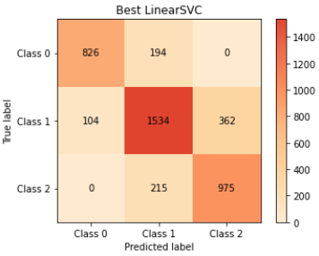

# NASA TurbofanRUL classifier SVC

@Author: Lenny Boegli
@Date: 2020-01-01
@Version: 1.0.0

# Description :

Cette partie du TP a pour but d'implémenter un classificateur autre que du Neural Network de manière individuelle.

## Extraction des données

Pour l'extraction des données, pareil que pour le NN, on a la possibilité de regrouper les nCycles ensemble pour faire la classification du cycle d'après. 

Le scaler va fit sur le premier passage dans la fonction et puis seulement transform sur tous les passages suivants.

Ceci permet de fit sur le train, puis de transform sur le test.

## Séparation des données

La séparation des données est faite en deux étapes. La première est de choisir un pourcentage de train val et test. Ces pourcentages vont décider le nombre de moteurs de train et de tests et de vals. Ces moteurs seront séparés dès le début.

La deuxième étape est de regrouper les cycles ensemble. Si le nombre de cycles est 3 par exemple, le résultat sera 2 features des cycles précédents 1 features du cycle actuel et le label de la classe du cycle actuel.

Dans ce dataset, il n'y a pas de nan, donc pas de fillna et pas de drop.
Par contre, le regroupement va s'assurer de ne pas mélanger les moteurs et cylces afin d'éviter d'avoir des cycles précédents qui n'ont rien à voir avec le cycle actuel.

## Classification

Le dataset de base est un dataset de type régression. Au lieu de faire une régression, nous avons décidé de classifier le nombre de cycles en 3 classes.

High health medium health et low health.

La raison étant qu'au cas où on voulait implémenter le modèle dans un cockpit d'un avion, ça serait plus simple à comprendre pour un pilote.

Pour cette raison, les résultats sont en accuracy et non pas en mean absolute error.

## Choix de la baseline

La classification choisissent ne donne pas des classes de même probabilité. La classe médium est plus probable que les 2 autres classes.
Pour cette raison, la baseline sera de prédire la classe médium a chaque fois.

Ceci nous donne un baseline a battre d'environ 0.48.
Il serait possible de faire des classes de même probabilité et on aurait une baseline de 0.33 dans ce cas.

## Choix du classifieur

Pour le choix du classifieur, Lazypredict a été lancé sur le dataset et SVC faisait parti du top 2 niveaux précision.

## Sélection des hyper paramètres

Pour le trouver les hyper hyper paramètres, un grid search sur le paramètre C,tol et loss a été lancé.

Il ce trouve de mettre le paramètre dual a False est mieux et ceci ne permet pas d'utiliser la loss hinge n'est pas compatible avec le dual a False.

Au début, le search a été lancé sur une petite search space et puis de plus en plus grande pour trouver les meilleurs hyper paramètres.

La précision sans grid search est d'environ 0.791 et le search dure assez longtemps, environ 4 minutes.

Le grid search trouve les hyper paramètres suivants :
 * C : 0.07
 * tol : 0.004
 * loss : squared_hinge
 * dual : False
 * max_iter : 10000

 Ce qui nous donne une précision de 0.7922.

 Comparée au paramètre de base, cette précision est mieux de 0.0015.

## Résultats obtenus

Comparaison du SVC au NeuralNetwork

Le SVC a une précision de 0.7922 et le NeuralNetwork a une précision de 0.75.
Déjà pour la précision globale, le SVC est notablement plus performant.

 

On peut voir que le SVC est plus performant que le NN dans toutes les classes.

Il est possible qu'avec d’autres layers du NN, il soit possible de faire mieux que le SVC.

Des recherches on montre qu'il existe des searches similaires au gridsearch pour les NN.

Exécuter une optimisation de telle sorte serait intéressant.

## Conclusion

Ce TP implémente un classificateur autre que du NeuralNetwork dans ce cas, un LinearSVC avec un gridsearch pour optimiser les hyper paramètres.
Le classificateur SVC est plus performant que le NN LSTM qui a été développé dans la partie en groupe du TP.

Le NN LSTM pourrait être plus optimisé pour faire evt. mieux que le SVC alors que le SVC est déjà optimisé.

### Lien

[NN optimisation]https://towardsdatascience.com/how-to-find-optimal-neural-network-architecture-with-tensorflow-the-easy-way-50575a03d060)

